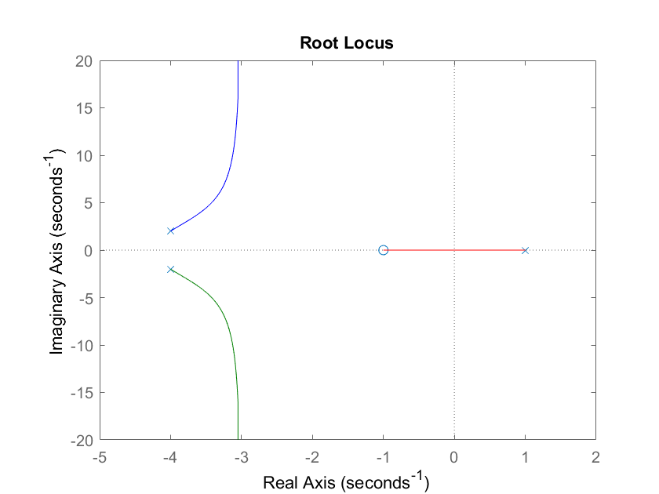

# Root_Locus_Solver
Solves for [root locus information](https://en.wikipedia.org/wiki/Root_locus). Used in controls problems. Requires knowing the characteristic equation *or* locations of poles/zeros. Note characteristic equation is in Laplace domain.

To confirm the solutions, check against a graphical root locus solver. An example of this is MatLab's `rlocus` function.


## Public Functions

#### root_locus
`root_locus(b_coefficients = None, a_coefficients = None, zeros = None, poles = None, K_degree = "positive")`

Requires user to provide either b_coefficents and a_coefficents *or* zeros and poles. Given a characteristic equation of form a(s) + K\*b(s) = 0, *or* of the form 1 + K\*b(s)/a(s) = 0. b_coefficients and a_coefficents are the coefficients of the [monic polynomials](https://en.wikipedia.org/wiki/Monic_polynomial) b(s) and a(s). The zeros are the roots of b(s) and the poles are the roots of a(s).

If K_degree is "negative", this will provide root locus info for when gain is less than 0.

Returns a dict of values which includes:
- poles: Pole locations. Possibly complex numbers.
- zeros: Zero locations. Possibly complex numbers.
- asymptote_centroid: Centroid of asymptotes. Possibly complex number.
- asymptote_angles: Angles that asymptote lines make with respect to the x-axis. In degrees.
- departure_angles: Angles that branches make when departing original locations (poles). In degrees.
- real_axis_points: Points where branches enter/exit the real-axis. Real number.
- real_axis_angles: Angles of arrival for branches entering the real-axis. In degrees.

## Example

```
from root_locus_solver import root_locus
from pprint import pprint

poles = [ -4 + 2j, -4 - 2j, 1 ]
zeros = [ -1 ]

values = root_locus(poles = poles, zeros = zeros)
pprint(values)
```
```
>>> {'poles': [(-4+2j), (-4-2j), 1],
>>>  'zeros': [-1],
>>>  'asymptote_centroid': (-3+0j),
>>>  'asymptote_angles': array([-90.,  90.]),
>>>  'departure_angles': [78.11134196037204, 281.88865803962796, 180.0],
>>>  'real_axis_points': array([], dtype=complex128),
>>>  'real_axis_angles': []}
```



This plot was generated with MatLab's `rlocus` function.
